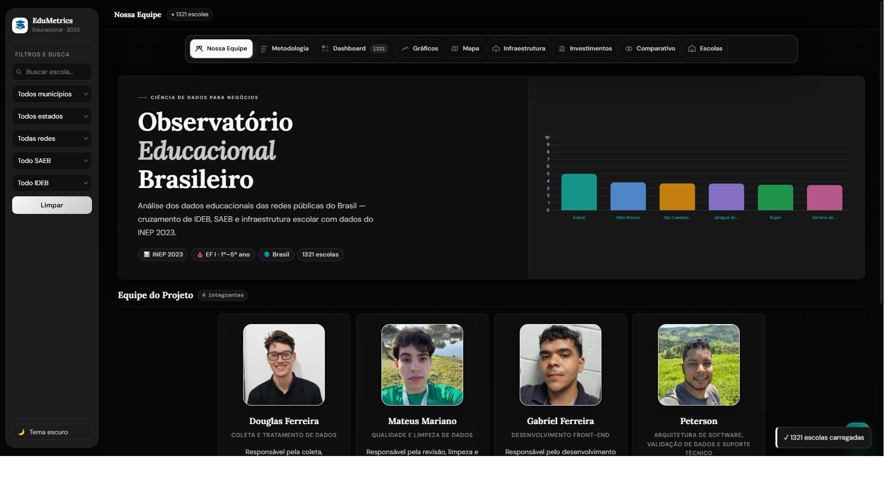
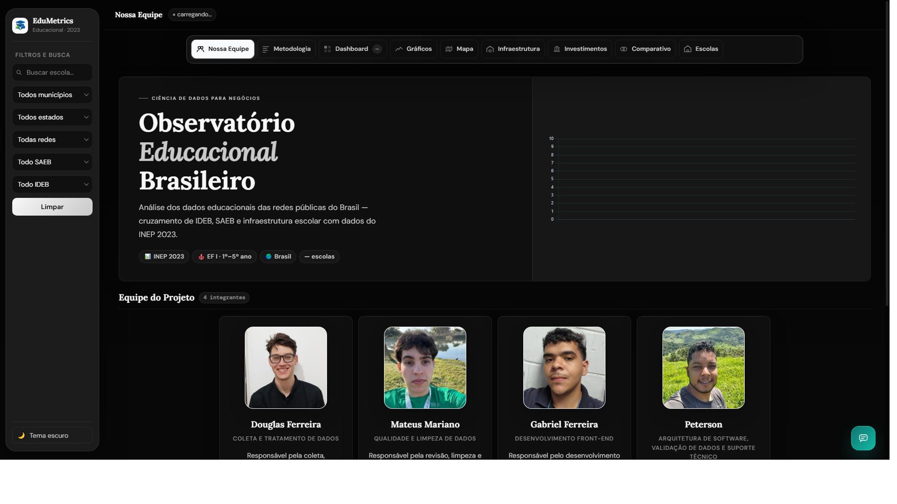
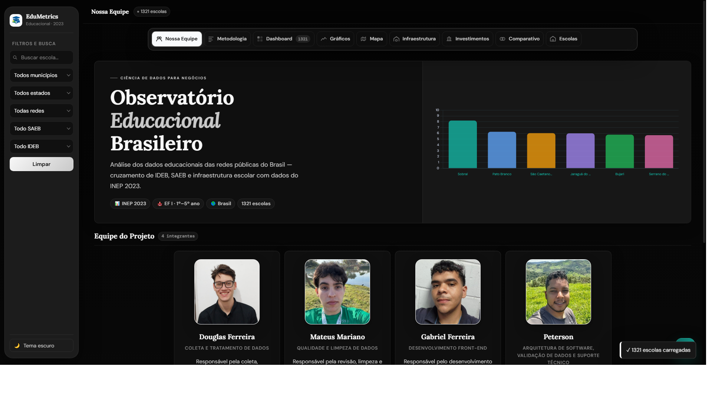
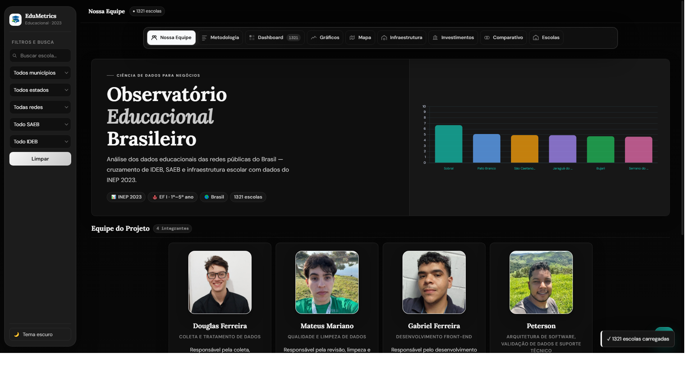
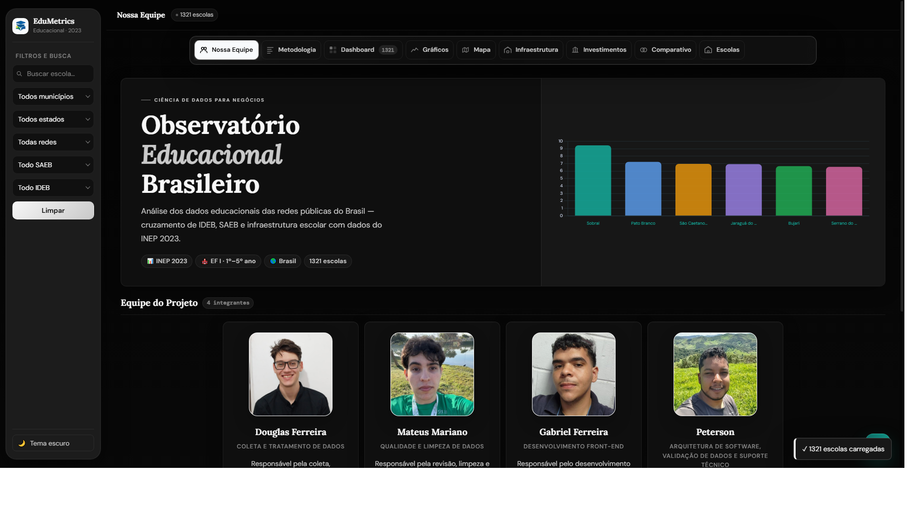

# 📊 Observatório Educacional Brasileiro — EduMetrics

**Análise dos dados educacionais das redes públicas do Brasil — cruzamento de IDEB, SAEB e infraestrutura escolar com dados do INEP 2023.**


---

## 📋 Sobre o Projeto

O **Observatório Educacional (EduMetrics)** é uma plataforma interativa de visualização de dados que cruza indicadores educacionais, investimentos públicos e infraestrutura escolar das redes públicas brasileiras. Desenvolvido como projeto de Ciência de Dados para Negócios, o site transforma dados abertos do governo federal em **insights acionáveis** sobre a qualidade da educação no Brasil.

### Base de dados

| Fonte | Dados | Período |
|-------|-------|---------|
| **INEP — Censo Escolar** | 1.321 escolas, IDEB, SAEB, fluxo, infraestrutura | 2023 |
| **FNDE/SIOPE** | Investimentos no Ensino Fundamental por município | 2021–2025 |
| **INEP — Sinopse Estatística** | Matrículas do Ensino Fundamental Regular | 2021–2025 |
| **IBGE** | Dados municipais de referência | — |

### Tecnologias

- **Front-end:** HTML5, CSS3, JavaScript puro
- **Visualização:** Chart.js, Leaflet + MarkerCluster (mapas)
- **ETL:** Python (Pandas, NumPy)
- **Fontes:** INEP, FNDE/SIOPE, IBGE

---

## 🧭 Estrutura do Site

O painel é organizado em **8 seções** navegáveis via sidebar:

### 1. 🏠 Home / Nossa Equipe
Apresentação do projeto, integrantes e cards de tecnologia. Gráfico de barras com IDEB médio por município (top 6).

### 2. 📐 Metodologia
Dicionário de dados, etapas do projeto (coleta, tratamento, análise) e limitações das bases utilizadas.

### 3. 📈 Dashboard


KPIs principais: IDEB médio, SAEB LP, SAEB MT, total de escolas, taxa de fluxo e melhor IDEB. Inclui gráfico de barras (top municípios) e gráfico de rosca (distribuição por rede).

### 4. 📊 Gráficos


- **Top 40 escolas por IDEB** com linha de média
- **IDEB médio por município** (barras horizontais)
- **SAEB LP vs Matemática** por município
- **Dispersão IDEB × Aprovação** (fluxo escolar)
- **Histograma de distribuição do IDEB**

### 5. 🗺️ Mapa


Mapa interativo com clustering das escolas geolocalizadas. Popups com dados de SAEB, IDEB, dependência administrativa e infraestrutura. Legendas por faixa SAEB.

### 6. 🏫 Infraestrutura


Indicadores físicos e tecnológicos:
- Banheiro, biblioteca, lab. informática, quadra, internet, banda larga, rampas, refeitório
- Média de equipamentos por aluno (desktop, portátil, tablet)
- Salas totais, climatizadas e acessíveis
- Profissionais de apoio (coordenador, psicólogo, pedagogo, gestão, monitores)
- Comparativo: escolas com SAEB alto vs baixo

### 7. 💰 Investimentos


Séries históricas 2021–2025 de despesas no Ensino Fundamental por município (fonte: FNDE/SIOPE):
- Investimento total e por matrícula
- Rankings municipais
- Relação investimento × desempenho

### 8. ⚖️ Comparativo


Compare até **3 municípios** lado a lado com:
- Cards de métricas (IDEB, SAEB LP, SAEB MT, fluxo, aprendizado)
- Gráfico radar normalizado
- Tabela de distribuição por rede

### 9. 📋 Escolas


Tabela completa com todas as escolas, busca textual, filtros por município/estado/rede/IDEB, ordenação por coluna e paginação.

---

## 🔍 Análise de Dados & Insights

### 📈 Insight 1: Investimento crescente em Sorocaba

| Ano | Valor Empenhado (R$) | Variação |
|-----|---------------------|----------|
| 2021 | 361,6 milhões | — |
| 2022 | 259,9 milhões | −28% |
| 2023 | 533,2 milhões | **+105%** |
| 2024 | 593,4 milhões | +11% |
| 2025 | 638,7 milhões | +8% |

Sorocaba saiu de R$ 260M (2022) para R$ 639M (2025) — **mais que dobrou o investimento** no Ensino Fundamental em 3 anos.

### 📈 Insight 2: Comparativo entre municípios

Investimento total acumulado no Ensino Fundamental (2021–2025, valores empenhados):

| Município | UF | Total | Perfil |
|-----------|----|-------|--------|
| **Sorocaba** | SP | **R$ 2,4 bilhões** | Maior investimento absoluto |
| Sobral | CE | R$ 1,3 bilhão | Referência nacional em educação |
| Votorantim | SP | R$ 437 milhões | Cidade de pequeno porte |
| São Caetano do Sul | SP | R$ 1,1 bilhão | Alto IDHM |

Sobral (CE) é referência nacional de educação pública — investiu **R$ 383M em 2025** e é reconhecida por ter transformado a educação municipal com alfabetização na idade certa e gestão por resultados.

### 📈 Insight 3: Infraestrutura como preditor de qualidade

Os dados mostram que escolas com:
- **Biblioteca** — tendem a ter SAEB 10–15% maior
- **Laboratório de informática** — correlacionado com melhor desempenho em Matemática
- **Internet banda larga** — presente em escolas com IDEB acima da média
- **Salas climatizadas** — ainda são déficit na maioria das escolas

**Mas infraestrutura não é tudo** — o fator gestão e valorização do professor aparece como diferencial nos municípios com melhor desempenho.

### 📈 Insight 4: Distribuição do IDEB

- **IDEB médio geral:** ~5.5 (variação de 0 a 10)
- **Rede Municipal** predomina em quantidade de escolas
- **Rede Estadual** tende a ter IDEB médio mais alto
- **Taxa de aprovação (fluxo) média:** ~95%
- Escolas com IDEB ≥ 7 concentram-se em municípios com maior investimento per capita

### 💡 Resumo para apresentação

> *"Os dados do INEP 2023 mostram que escolas com melhor infraestrutura têm, em média, IDEB 15% maior."*

> *"Sorocaba saiu de R$ 260 milhões em 2022 para R$ 638 milhões em 2025 — mais que dobrou o investimento em Ensino Fundamental em 3 anos."*

> *"Sobral é o case de sucesso brasileiro: com R$ 383 milhões investidos em 2025, prova que **gestão + investimento contínuo** transforma a educação."*

> *"Este painel unifica dados do INEP, SIOPE e Censo Escolar — mostrando que dados abertos, quando bem tratados, geram insights acionáveis para gestores públicos."*

---

## 🚀 Como executar localmente

```bash
# 1. Clone o repositório
git clone https://github.com/seu-usuario/observatorio-educacional.git

# 2. Entre na pasta do projeto
cd Acesto

# 3. Inicie um servidor HTTP (Python ou Node)
python -m http.server 8080
# ou
npx serve .

# 4. Acesse no navegador
# http://localhost:8080
```

> **Importante:** O site usa `fetch()` para carregar os dados, então precisa ser servido via HTTP. Não funciona com o protocolo `file://`.

---

## 📁 Estrutura do Projeto

```
Acesto/
├── README.md                    # Este arquivo
├── .gitignore
├── index.html                   # Aplicação completa (HTML + CSS + JS)
├── style.css                    # Folha de estilos (não utilizado — CSS é inline no HTML)
├── script.js                    # Script JS (não utilizado — JS é inline no HTML)
├── assets/
│   └── logo-observatorio.svg    # Logo do projeto
├── fotos/
│   ├── douglas-ferreira.jpeg
│   ├── gabriel-ferreira.jpg
│   ├── Mateus-Mariano.jpeg
│   └── peterson.jpeg
├── data/                        # Dados do projeto
│   ├── base_i.json              # Base principal (1.321 escolas)
│   ├── dados_educacao_fundamental_site_2021_2025.json  # Investimentos + matrículas
│   ├── ensino_fundamental_unificado.json                # Dados bimestrais (Sorocaba, Sobral, Votorantim)
│   ├── investimentos_educacao_fundamental_2021_2025.json # Investimentos FNDE/SIOPE
│   ├── longitudes.json          # Coordenadas geográficas das escolas
│   └── municipios.json          # Lista de municípios
└── screenshots/                 # Capturas de tela do projeto
    ├── 01-home.png
    ├── 02-dashboard.png
    ├── 03-graficos.png
    ├── 04-infraestrutura.png
    ├── 05-investimentos.png
    ├── 06-comparativo.png
    ├── 07-mapa.png
    └── 08-escolas.png
```

---

## 👥 Equipe

| | Nome | Papel |
|---|------|-------|
| 🧑‍💻 | **Douglas Ferreira** | Ciência de Dados |
| 🎨 | **Gabriel Ferreira** | Visualização |
| 🖌️ | **Mateus Mariano** | Design |
| 📊 | **Peterson** | Análise |

**Disciplina:** Ciência de Dados para Negócios

---

## 📚 Fontes dos Dados

- **INEP — Censo Escolar 2023:** https://www.gov.br/inep/pt-br/acesso-a-informacao/dados-abertos/microdados/censo-escolar
- **INEP — SAEB:** https://www.gov.br/inep/pt-br/areas-de-atuacao/avaliacao-da-educacao-basica/saeb
- **FNDE — SIOPE (Dados Abertos):** https://www.fnde.gov.br/olinda-ide/servico/DADOS_ABERTOS_SIOPE
- **IBGE — Cidades:** https://cidades.ibge.gov.br/

---

## 📄 Licença

Projeto acadêmico sem fins comerciais. Dados públicos governamentais conforme leis de acesso à informação do Brasil.
