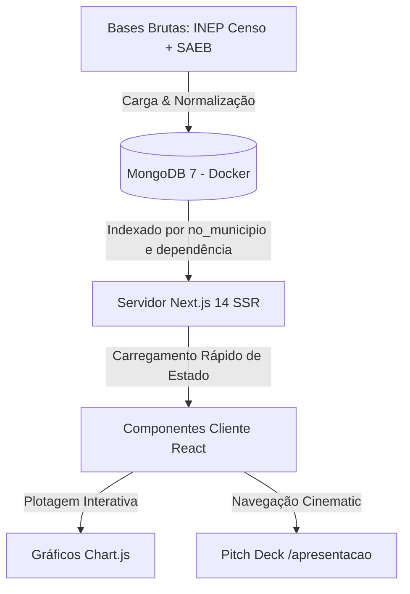

# 🤖 Observatório Educacional — Contexto Geral do Projeto (agents.md)

Este documento foi criado para guiar futuros agentes de inteligência artificial (e desenvolvedores humanos) que trabalharem neste repositório. Ele reúne o contexto de negócios, a tese estatística pedagógica formulada, a arquitetura de dados e as regras de desenvolvimento do projeto.

---

## 🔍 1. O Problema e a Justificativa

### O Mistério da Queda de Qualidade
Embora existam escolas de alto desempenho na região de Sorocaba e Votorantim, muitas unidades sob condições financeiras e geográficas semelhantes não alcançam o mesmo nível. O objetivo deste observatório não é apenas classificar as escolas em rankings, mas **identificar precisamente o ponto de inflexão e as causas onde a qualidade de ensino sofre uma quebra.**

### Por que Anos Iniciais (3º e 4º anos)?
O foco estratégico do estudo está exclusivamente nas séries iniciais do Ensino Fundamental I:
1. **Linha de Governabilidade**: O Ensino Fundamental II (8º e 9º anos) é gerenciado quase integralmente pelo **Governo do Estado**. Avaliar essas séries não reflete a efetividade das políticas das prefeituras. O Fundamental I é de responsabilidade **100% municipal**.
2. **Economia da Educação (Retorno na Base)**: A consolidação da alfabetização e matemática básica na "idade de ouro" (3º/4º anos) evita o acúmulo de prejuízo pedagógico. Corrigir falhas de leitura e cálculo no Ensino Médio é extremamente lento e caro para o poder público.

---

## 📊 2. A Tese Estatística Central (O Paradoxo)

Cruzando os dados imutáveis do Censo Escolar e do INEP 2023, o projeto validou as seguintes conclusões analíticas de impacto para o negócio da educação:

### A) O Paradoxo IDEB × Infraestrutura
* **Nossa Região**: Sorocaba e Votorantim possuem escolas com excelente infraestrutura (Score de **70% a 80%** de presença de laboratórios, informática, esgoto, água e banda larga). No entanto, o IDEB médio regional concentra-se na faixa mediana de **5.9 a 6.2**.
* **O Outlier (Sobral - CE)**: Sobral lidera o IDEB do Brasil (média de rede **9.2**, com várias escolas obtendo nota **10.0** perfeita), mesmo dispondo de uma infraestrutura física simples de **58%**.
* **Conclusão**: Prédios modernos e computadores não compram notas altas. A qualidade de ensino depende estritamente de fatores pedagógicos e gestão ativa do tempo de aula.

### B) A Quebra de Qualidade é 100% Pedagógica (SAEB)
* O IDEB é o produto de duas variáveis: $IDEB = N \times P$ (onde $N$ é a nota de proficiência do SAEB e $P$ é a taxa de fluxo escolar/aprovação).
* A análise comparativa revelou que as melhores escolas de Sorocaba e Votorantim possuem **Fluxo Perfeito de 1.0 (100% de aprovação e retenção de alunos)**.
* **Conclusão**: O gap de quase **2.8 pontos no IDEB** regional em relação aos benchmarks nacionais deve-se **exclusivamente a notas mais baixas na proficiência real do SAEB (Leitura e Matemática)**. O aluno avança de ano com sucesso (fluxo perfeito), mas não domina os conteúdos plenamente.

---

## 🛠️ 3. Ecossistema Tecnológico & Arquitetura

O projeto é estruturado em Next.js 14 com uma infraestrutura robusta de banco de dados no MongoDB:



### Principais Componentes do Codebase:
1. **Banco de Dados**: Rodando MongoDB 7 via Docker. As credenciais de conexão são obtidas da variável `MONGODB_URI` em `.env.local`. As consultas são indexadas eficientemente.
2. **Camada SSR (Server Side Rendering)**: O Next.js App Router recupera dados imutáveis de escolas diretamente no servidor e passa como `initialData` para evitar lentidão e problemas de hidratação de tela.
3. **Visualizações Gráficas**: Utiliza `Chart.js` envelopado pelo `react-chartjs-2`. Os gráficos utilizam temas premium escuros com HSL ajustados no pitch deck.
4. **Pitch Deck de Slides (`/apresentacao`)**: Uma rota dedicada estruturada em formato de slides de alta fidelidade visual. Possui suporte a Fullscreen nativo e comandos de teclado (◀/▶ e Espaço).

---

## 🚨 4. Diretrizes de Desenvolvimento para Agentes de IA

Ao fazer alterações de código neste projeto, **você deve respeitar rigorosamente as seguintes diretrizes**:

### A) Diretrizes de CSS e Design Premium
* **Paleta Temática HSL**: Mantenha os gradientes premium do projeto (Orange Haste: `#FF6B2C`, Purple Accent: `#B14CFF`). Não crie classes ad-hoc de cores puras (`red`, `blue`).
* **Scoping do CSS de Apresentação**: Todos os estilos dos slides estão contidos em [apresentacao.css](file:///C:/Users/peterson.pereira/Documents/BitBucket/projeto-economia/observatorio/src/app/apresentacao/apresentacao.css). Lembre-se de que a página interativa do dashboard padrão usa [globals.css](file:///C:/Users/peterson.pereira/Documents/BitBucket/projeto-economia/observatorio/src/app/globals.css) (que possui variáveis e cores de tema claro).
* **Sobrescrita de Classes Globais**: Se for adicionar tabelas ou grids nos slides da apresentação, utilize seletores específicos (ex: `.pres-slide table`, `.pres-slide thead th`) e utilize `!important` para sobrescrever os estilos de tema claro do `globals.css` sem corromper a página principal `/`.

### B) Diretrizes de Next.js & TypeScript
* **Importação de CSS em Componentes Cliente (`use client`)**: O Next.js App Router **proíbe** a importação de arquivos CSS específicos/globais dentro de componentes de cliente (como `Presentation.tsx`). Os imports de CSS devem ser efetuados estritamente dentro de arquivos de rotas do Server Component (como [page.tsx](file:///C:/Users/peterson.pereira/Documents/BitBucket/projeto-economia/observatorio/src/app/apresentacao/page.tsx)).
* **Tipagem Estrita**: Respeite os tipos declarados em `@/lib/types`. Não utilize `any` de forma descuidada para evitar quebras de build do compilador TypeScript.
* **Validação de Builds**: Antes de entregar qualquer tarefa concluída, você **deve** atestar que o build de produção compila 100% com sucesso sem qualquer erro executando:
  ```bash
  npm run build
  ```

---

*agents.md — Criado em 20 de Maio de 2026. Mantenha este documento atualizado a cada grande modificação de escopo, regras de banco ou tese de negócios.*
